# **PROYECTO: MARKETPLACE**

## **DATOS GENERALES**

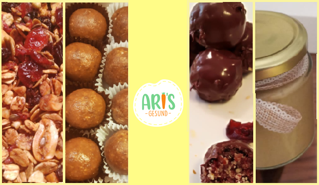

Emprendimiento: Aris Gesund  
Rubro: Alimentos  
Dueña: Romina Regalado  
Fecha de creación: Enero del 2019

## **¿Cómo inicio Aris Gesund?**

Nace a raíz de una condición de salud(colesterol) de la menor hija de una de las socias, en la búsqueda de recetas saludables para  mejorar su calidad de vida,  que reemplacen los dulces, las harinas refinadas, etc y además que pueda llevarse al nido como refrigerio, o usarlo para cualquier otro evento. 

Como primer acercamiento con un usuario decidieron probar la aceptación de los niños de estos bocaditos saludables dulces, identificando junto a su socia, quien es nutricionista, que si tenían la aceptación de estos productos, por lo que deciden asociarse en el mes de enero para formar una empresa para poder ofrecer todo tipo de bocaditos saludables(sin preservantes, sin azúcar refinada, saborizadas y todo al natural)

- - -

### ***Objetivos del proyecto***

Nuestro objetivo principal es implementar una pagina web la cual solucione las necesidades de nuestros usuarios y posibles usuarios. Para ello tenemos que:

- Conocer las debilididades y fortalezas de la empresa

- Conocer a nuestro publico objetivo 

- Conocer como es que buscan la pagina, que es lo que les motiva a comprar el producto, que le es mas importante para dar por sentada la compra

- Realizar mejoras sobre el proceso de compra/venta(tiempo de espera, proceso de compra fluido, multiples opciones de pago)

## **Herramientas usadas para la implementación**

Hemos usado las siguientes herramientas para llevar nuestra investigación a cabo.

|Actividad|Descripción|Puntos|
|:----|:---|:---:|
|Entrevistas con cliente|Realización de entrevistas con el cliente (dueño del reto) y establecimiento de sus metas y objetivos.|25|
|Benchmark| Revisión de features de la competencia y referencias análogas. | 20 |
|Entrevistas con usuarios| Entrevistas en profundidad con al menos 5 usuarios. | 60 |
|Flujo / árbol de contenidos|Documento que estructura contenidos y su navegación|15|
|Testeos de prototipos| Sesiones de testing de la solución propuesta (baja, media y alta fidelidad) con al menos 5 usuarios por sesión. | 60 |
|Sketching y wireframing| Elaboración de prototipos de baja y mediana fidelidad. | 30 |
|Prototipado de alta fidelidad| Elaboración de prototipo en base a las pantallas diseñadas. | 80 |

[Tabla de implementación](https://docs.google.com/document/d/1javrxtUo6EVp0c-c8n3sDXwiwRkoJeKgPHNx5xRl-ig/edit)

- - -

### **Descubrimiento e Investigación**

Antes de empezar con la entrevista al cliente, indagamos por el fan page para saber que es lo que ofrece y que tan presente esta en redes sociales.

#### 1. Entrevista con cliente

Acordamos con la cliente, Romina Regalado, una entrevista para poder conocer mas sobre su emprendimiento , lo que la motivó a realizarlo, sus fortalezas y debilidades como empresa.

La cliente nos indico que dado que la empresa recien cuenta con aproximadamente 6 meses de creación, buscan expandir su emprendimiento atrayendo nuevos usuarios ya que actualmente su publico frecuente ha sido su circulo cercano(amigos y familiares).

Hasta la fecha no cuentan con una pagina web, toda comunicación es por redes sociales, fan page en Instagram y Facebook

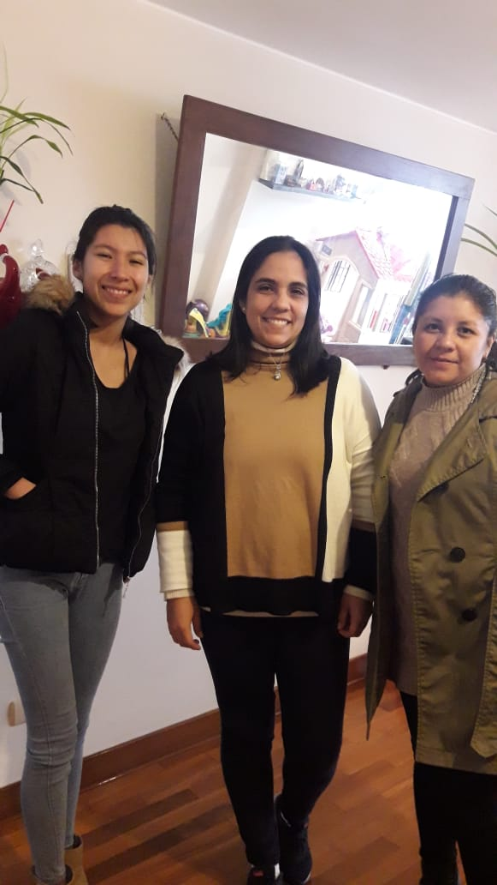

#### ***Documentos utilizados para entrevista***

[Guia de preguntas](https://docs.google.com/document/d/1pKN7ZMK_rJVyoE0pRxdhAl8ZwoA32iSb4ITPimx5VWY/edit)  
[Análisis de entrevista](https://docs.google.com/document/d/1C16UhG_-drCnr2rx-OQhNNBK2Jn4got4UFCpthVLFtc/edit)  
[Audio de entrevista](https://drive.google.com/drive/folders/10K7YmoTNYh7MC1tgtxpleguTFKgxjOkg)

#### 2. Benchmark

En el cuadro siguiente se observan 4 empresas que utilizamos para el benchmark que nos sirvieron de referencia sobre puntos fuertes que ellos tenian y que podian ser replicados.

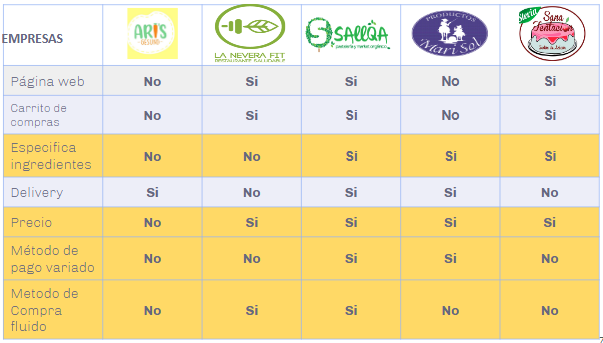    

En base al cuadro hemos podido concluir que nuestra competencia 3/4 cuentan con pagina web. Y hemos notado que 2/4 empresas cuentan con metodo de pago variado y un proceso de compra fluido.

[Cuadro benchmark](https://docs.google.com/document/d/1STSMaIVQFmG2ZgFqTl9dSRLHwnGUuTFzy9vC2xGulHY/edit)

#### 3. Entrevista con Usuarios o posibles Usuarios
    
Entrevistamos 4 posibles usuarios y 1 usuario. Con estas entrevitas queriamos conocer a nuestros usuarios y posibles usuarios para asi saber sus necesidades acerca de los productos saludables. 

#### ***Documentos utilizados para entrevista***

[Guia de preguntas usuarios](https://drive.google.com/open?id=1cfsYgLcTEYgrX6YB4pqhXal61jqOedfaaoZKvVBiyJM)  
[Guia de preguntas posibles usuarios](https://drive.google.com/open?id=1cww6y_wGfGt6xI45SZRrYGKur8_ybE_cFwAshlpejX4)  
[Análisis de entrevista]()  
[Audios de entrevista](https://drive.google.com/drive/folders/1G48vv6ci5Egb7tDyroTUIQXXY5Oeu72F)

### **Síntexis y Definición**
#### 1. Affinity Map

En base a las entrevistas realizadas con los usuarios pudimos agrupar las frases mas relevantes por grupos en un mapa de afinidad.

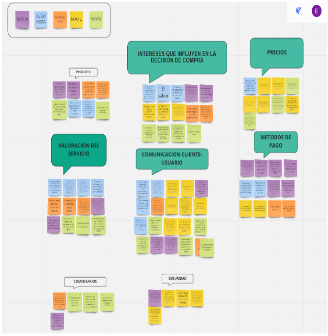
[Affinity map](https://miro.com/welcomeonboard/nmcQqjCcBKuLTEsJx4nlPnE17pxa1QSj4lHZoClrQ2MDS2TDXhtvgKAyHrRvmfeu)   

De lo cual pudimos resaltar los temas mas recurrentes:
    
- El proceso de compra/venta
- Valoración del producto
- Fluidez de compra
- Formas de pago

[Affinity map](https://miro.com/welcomeonboard/nmcQqjCcBKuLTEsJx4nlPnE17pxa1QSj4lHZoClrQ2MDS2TDXhtvgKAyHrRvmfeu)    

#### 2. User Persona

Ya con nuestras entrevistas realizadas y nuestro affinity map elaborado, creamos nuestro User Persona que viene a ser una representación de todos nuestros usuarios y posibles usuarios. Este representa sus frustraciones, motivaciones, datos demograficos, etc.

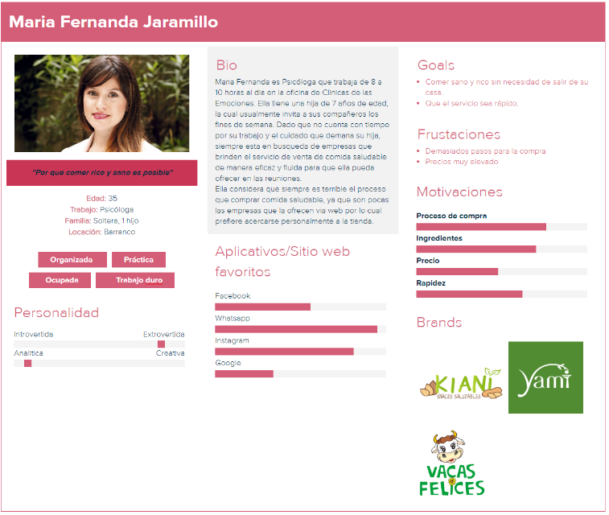
[User Persona](https://docs.google.com/document/d/1HtiVyBhGNr1ayWYiJnJZDD3znCRca2rh6wyo6OPgs0E/edit)

#### 3. Customer Journey Map

El Customer Journey Map nos sirvio para conocer los puntos de dolor en todo el viaje que realiza el usuario.

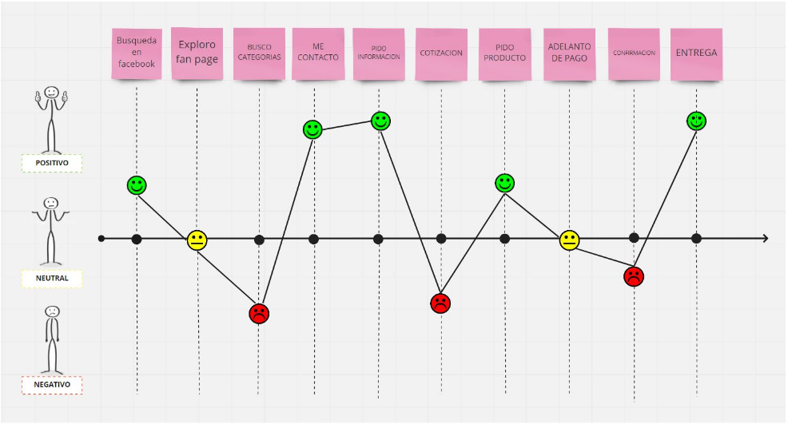    
[Customer Journey Map](https://docs.google.com/document/d/1tJRIkvfiBcik2E3zBJf7s89Q0Nd4fdYhzKEELrzv9kI/edit)

#### 4. Problem Statement 

Ahora que ya conocemos al nuestro usuario (User Persona) y sabemos sus necesidades, identificaremos los problemas para buscar los posibles soluciones. Obtuvimos 4 Problem Statements:

- 1. Maria Fernanda necesita una manera de ver las características de los productos para elegir correctamente el producto
- 2. Maria Fernanda necesita sentirse segura al hacer un pago online porque piensa que puedan engañarla.
- 3. Maria Fernanda necesita saber que hacer  para realizar su pedido de manera rápida.
- 4. Maria Fernanda necesita tener diferentes opciones de pago  para realizar la compra sin problemas.

[Problem Statements](https://docs.google.com/document/d/1yb1zTMa0CstN0WY1gt40kxR6tESL_4-qGep8DSlmEAg/edit)

#### 5. How Might We ?

Ya con nuestros Problem Statements definidos se procedió con los HMW:

- HMW hacer que los productos se visualicen de manera fácil 
- HMW para que haya una lista de opciones o categorías
- HMW brindarle una búsqueda personalizada*
- HWM hacer que la experiencia de compra le genere confianza
- HWM volver el tiempo invertido en el proceso algo positivo
- HMW mostrarle  novedades
- HMW hacer que el proceso de pago sea mediante un solo paso
- HWM en caso no contemos con método de pago por tarjeta, brindarle una solución eficaz

#### **Planteamiento de soluciones**

Luego del proceso de investigación y síntesis teniendo en cuenta las necesidades del los usuarios y los problemas hallados planteamos las siguientes soluciones:

- Implementar una web e-comerce, porque hay una necesidad de hacer compras en línea por un tema de facilidad y ahorro de tiempo
- Implementar un espacio que incluya las categorías de los productos lo que hará una web ordenada, fácil de explorar y cómoda para los usuarios.
- Implementar un método de pago que sea seguro y confiable para los usuarios, utilizando una pasarella de pago conocida que pueda brindar simplicidad y seguridad.

### **Ideación** 
#### 1. Crazy 8

Utilizamos esta herramienta para ver posibles soluciones que queremos plasmar en nuestro sketch.

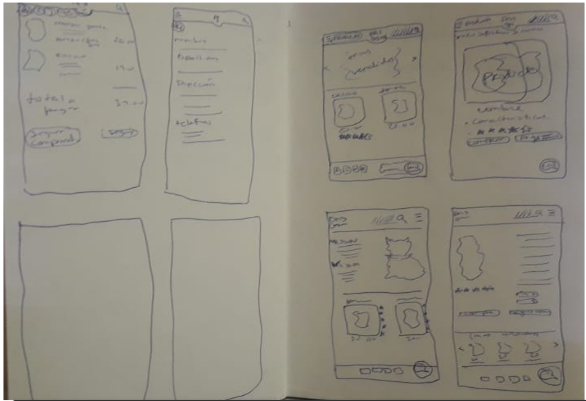
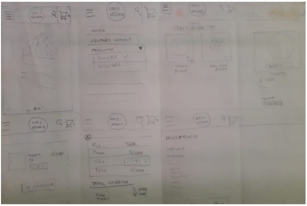

#### 2. Sketch 3 pantallas

Se realizó los sketches ya teniendo en cuenta lo realizado en el Crazy 8 y **Descubrimiento e Investigación y Sintesis y Definición**.

**INICIO**
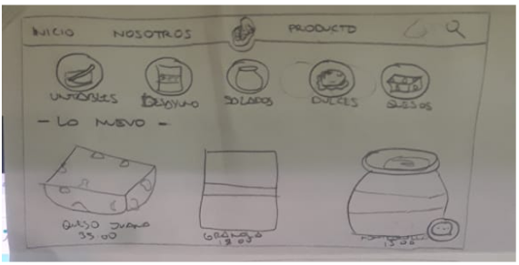

**CARACTERISTICAS DE PRODUCTO**
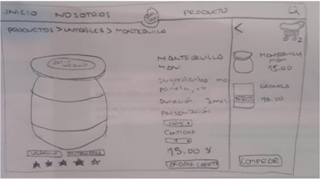

**PROCESO DE PAGO**
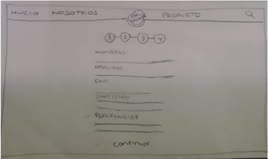

#### 3. User Flow

Utilizamos esta herramienta para poder saber cuales son las posibles interacciones.

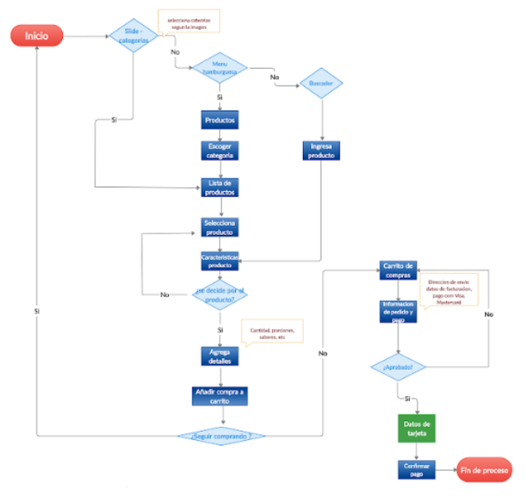
[User Flow](https://drive.google.com/open?id=1jsq278OpGOlp1jYySWTDw0iZgw3GUjHb)

### **Prototipado y User Testing**

#### 1.Prototipo de baja fidelidad

Realizamos un primer prototipo de baja fidelidad a partir de la información previa obtenida de el sketch 3 pantallas y crazy8.
Se les pidió a los usuarios que observaran el flujo e indicarán qué es lo que ven. e identifiquen  los posibles contenidos y categorías de la página.

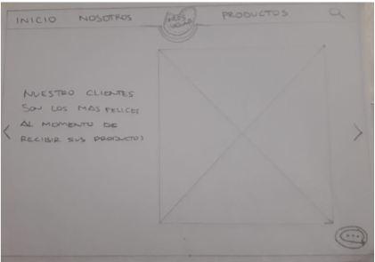
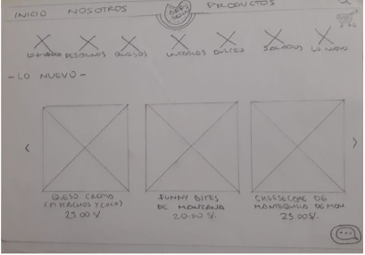

Conclusiones:

- Los usuarios identifican rápidamente la estructura de la página, ya que al parecer se les hacía muy intuitiva.
- Los usuarios consideran importante el hecho de que existan imágenes en la web aun sin saber de qué se trata.

#### 2.Prototipo de media fidelidad

Para realizar este prototipo tomamos en cuenta las referencias de testing e hicimos las mejoras en los puntos que habíamos notado era necesario hacerlo :

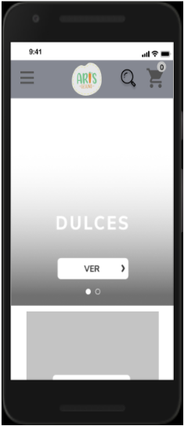
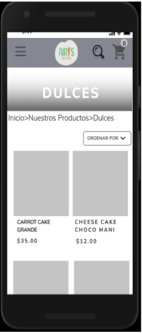
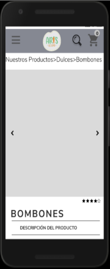
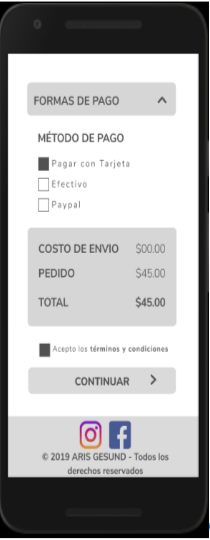

[Prototipo de media](https://www.figma.com/proto/vzXUGxzgqI2zsdP1VzwTJU/PROTOTIPO-DE-MEDIA?scaling=scale-down)

#### 3.Prototipo de alta fidelidad

Para realizar este prototipo tomamos en cuenta el benchmark dado que no contamos con test de usuario en el prototipo de media fidelidad e hicimos las mejoras en los puntos que habíamos notado era necesario hacerlo :

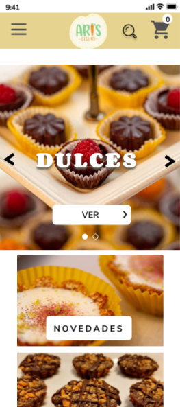
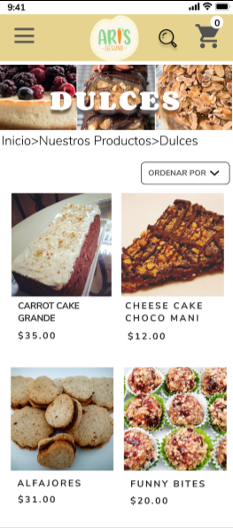
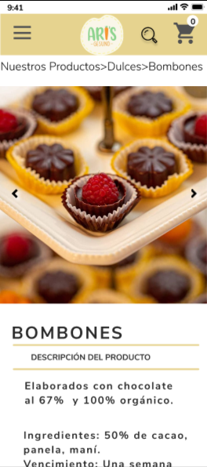

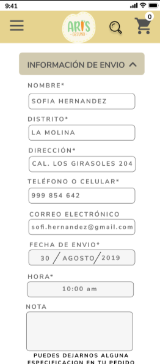

[Prototipo de alta](https://www.figma.com/proto/4nwGu5QtiV9ZcR9DZxZ37Q/PROTOTIPO-DE-ALTA?scaling=scale-down&node-id=13%3A3)

### **Link a video de loom**

[Loom](https://www.loom.com/share/818f0a89862c4cbab661f2d643d0c88f)

### **Link a zeplin**

[Zeplin](https://app.zeplin.io/project/5d69777ee38e740efbf7eaa8)

### **Link a carpeta de Drive**

[Drive](https://drive.google.com/drive/folders/1mkczmLXqy8TCRchMB3sHUBQyb9qNnrGp)
